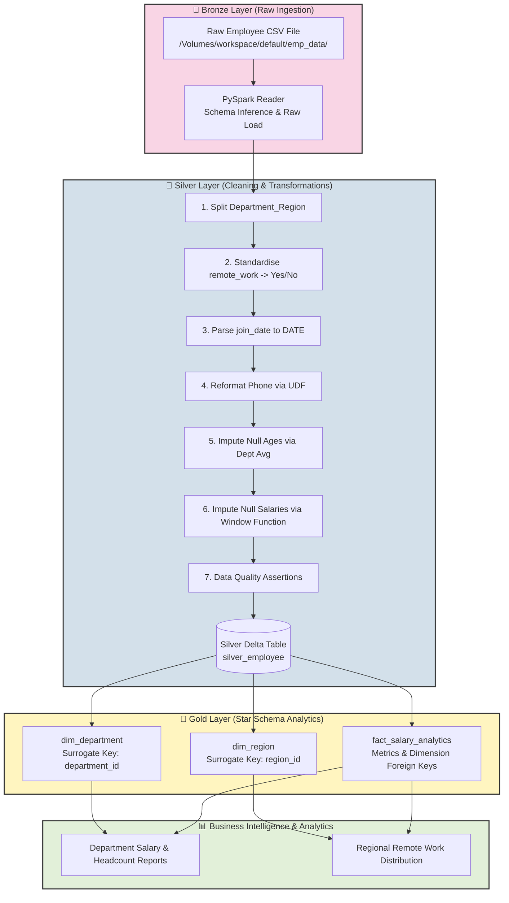
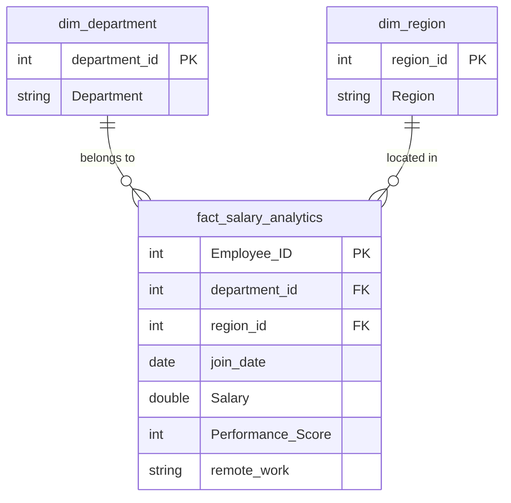

# Employee ETL Pipeline | PySpark & Delta Lake on Databricks

[](https://databricks.com/)
[](https://spark.apache.org/)
[](https://delta.io/)
[](#architecture-overview)
[](#star-schema-data-model)

An end-to-end Enterprise Employee ETL Pipeline built on **Databricks** utilizing **PySpark** and **Delta Lake**. The project demonstrates a production-grade **Medallion Architecture (Bronze → Silver → Gold)** with advanced data cleaning, window-based null imputation, data quality enforcement, and dimensional modeling (Star Schema).

---

## 📌 Table of Contents
- [Architecture Overview](#architecture-overview)
- [Key Features](#key-features)
- [Data Pipeline Stages](#data-pipeline-stages)
  - [1. Bronze Layer (Raw Ingestion)](#1-bronze-layer-raw-ingestion)
  - [2. Silver Layer (Cleaning & Quality Control)](#2-silver-layer-cleaning--quality-control)
  - [3. Gold Layer (Dimensional Modeling & Analytics)](#3-gold-layer-dimensional-modeling--analytics)
- [Star Schema Data Model](#star-schema-data-model)
- [Sample Analytical Queries](#sample-analytical-queries)
- [Repository Structure](#repository-structure)
- [Getting Started & Usage](#getting-started--usage)
- [Tech Stack](#tech-stack)

---

## 🏗 Architecture Overview

The pipeline follows the **Medallion Architecture** pattern to guarantee data reliability, traceability, and high analytical performance.



---

## 🌟 Key Features

- **Department-Aware Salary Imputation**: Uses PySpark `Window.partitionBy('Department')` to replace missing salary values with department-level averages rather than inaccurate global averages.
- **Custom PySpark UDF**: Reformats phone numbers into a standardized `XXXX-XXX-XXX` format.
- **Automated Data Quality Gates**: Enforces strict `assert` validations (checking for nulls, invalid ages, unmapped departments) before persisting into the Silver Delta table.
- **Delta Lake Integration**: Enables ACID transactions, time-travel, and high performance for analytical workloads.
- **Dimensional Modeling**: Constructs a clean **Star Schema** with `dim_department`, `dim_region`, and `fact_salary_analytics`.

---

## 🔄 Data Pipeline Stages

### 1. Bronze Layer (Raw Ingestion)
- **Source**: Databricks Unity Catalog Volume path (`/Volumes/workspace/default/emp_data/`).
- **Process**: Raw CSV ingestion preserving exact source records without premature transformation.

### 2. Silver Layer (Cleaning & Quality Control)
Transformations applied to standardize, clean, and validate data:
1. **Column Splitting**: Splits composite `Department_Region` (e.g., `'Engineering-North'`) into distinct `Department` and `Region` attributes.
2. **Boolean Standardisation**: Converts boolean flags in `remote_work` into user-friendly `'Yes'` / `'No'` values.
3. **Date Parsing**: Parses raw string dates into proper `DATE` types using `to_date(col('join_date'), 'dd-MM-yyyy')`.
4. **Phone Formatting UDF**: Strips leading/trailing symbols and formats phone numbers into `XXXX-XXX-XXX`.
5. **Null Age Imputation**: Calculates valid average age and imputes missing values.
6. **Window-based Salary Imputation**: Computes average salary per department partition and imputes missing salary records dynamically.
7. **Quality Assertions**: Validates that zero nulls exist in key fields before writing.
8. **Storage**: Persisted as a Delta Lake table named `silver_employee` using `overwrite` mode.

### 3. Gold Layer (Dimensional Modeling & Analytics)
- **`dim_department`**: Creates department surrogate keys (`department_id`) using `DENSE_RANK() OVER (ORDER BY Department)`.
- **`dim_region`**: Creates region surrogate keys (`region_id`) using `DENSE_RANK() OVER (ORDER BY Region)`.
- **`fact_salary_analytics`**: Joins `silver_employee` with dimension tables to form the central fact table containing metrics like `Salary`, `Performance_Score`, `remote_work`, and `join_date`.

---

## 📐 Star Schema Data Model



---

## 📈 Sample Analytical Queries

### 1. Departmental Salary & Headcount Overview
```sql
SELECT 
    d.Department, 
    ROUND(AVG(f.Salary), 2) AS avg_salary,
    COUNT(*) AS headcount
FROM fact_salary_analytics f
JOIN dim_department d ON f.department_id = d.department_id
GROUP BY d.Department
ORDER BY avg_salary DESC;
```

### 2. Regional Remote Work Distribution
```sql
SELECT 
    r.Region, 
    f.remote_work,
    COUNT(*) AS employee_count
FROM fact_salary_analytics f
JOIN dim_region r ON f.region_id = r.region_id
GROUP BY r.Region, f.remote_work
ORDER BY r.Region, f.remote_work;
```

---

## 📁 Repository Structure

```
employee_etl/
├── README.md                   # Project documentation & architecture guide
└── employee_ETL_clean.ipynb    # Main Databricks PySpark ETL notebook
```

---

## 🚀 Getting Started & Usage

1. **Import Notebook into Databricks**:
   - Upload `employee_ETL_clean.ipynb` into your Databricks workspace.
2. **Configure Data Source**:
   - Upload your raw employee CSV data to Databricks Volume: `/Volumes/workspace/default/emp_data/`.
3. **Execute Pipeline**:
   - Run all cells sequentially in Databricks.
   - The notebook will ingest raw data, execute transformations, run data quality checks, and create the Silver Delta table and Gold analytical views/tables.

---

## 🛠 Tech Stack

- **Platform**: Databricks
- **Processing Engine**: PySpark (Apache Spark 3.x)
- **Storage Layer**: Delta Lake
- **Query Language**: Spark SQL & PySpark DataFrame API
- **Data Modeling**: Star Schema (Fact & Dimension Tables)
- **Diagrams**: Mermaid.js
